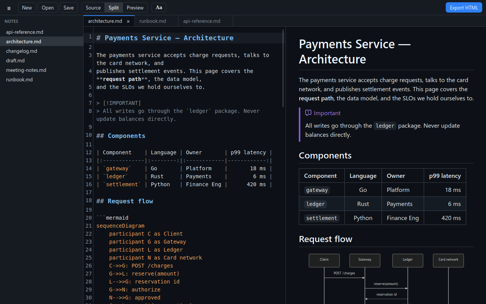
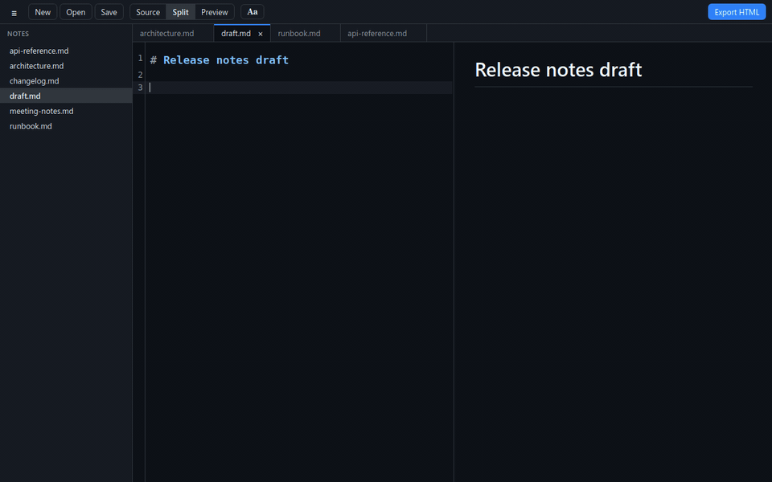
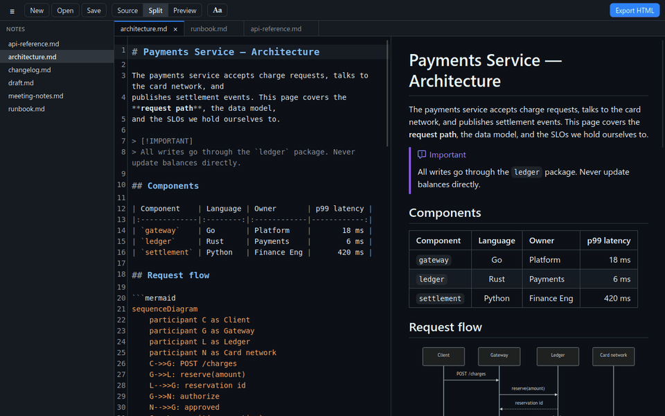
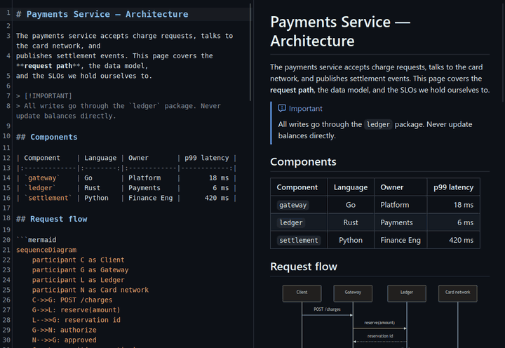
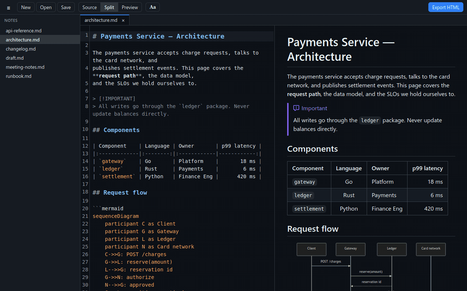
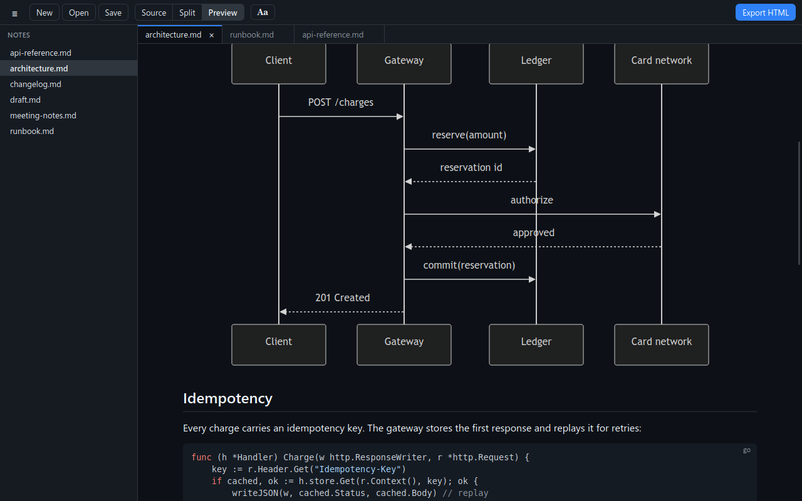
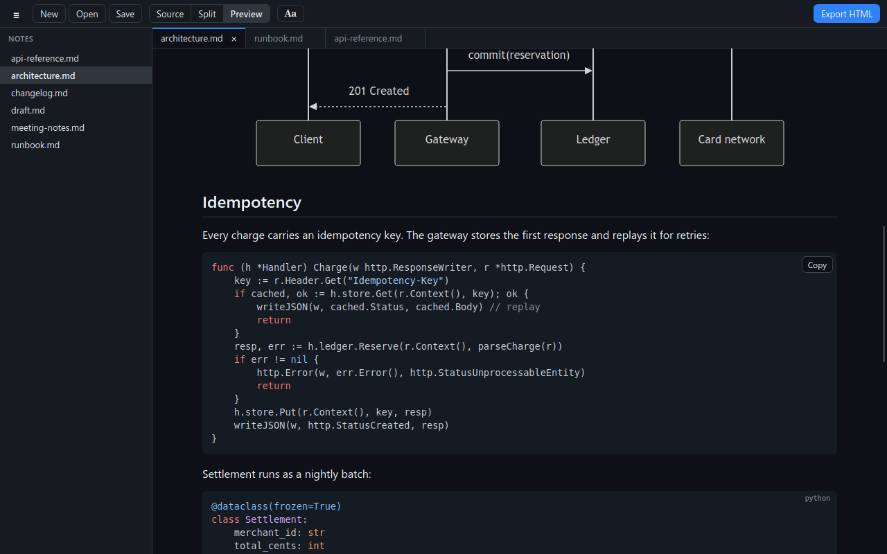
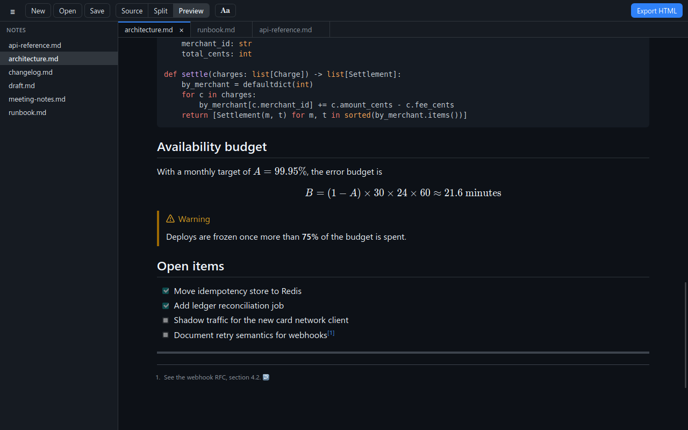
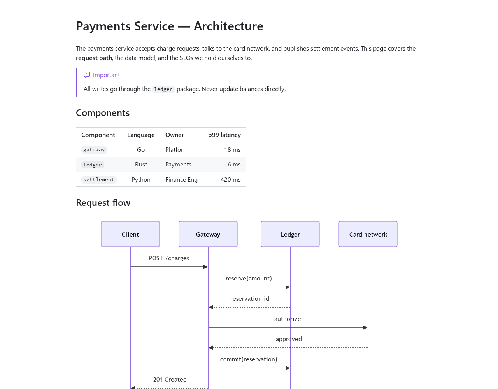
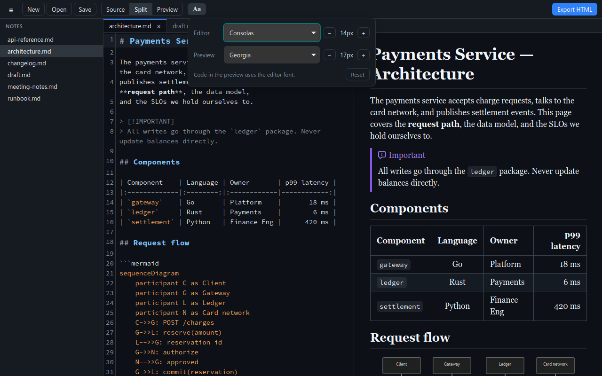

<div align="center">


# mdedit

**A small, fast Markdown editor for Linux, macOS and Windows, with an accurate live preview.**

[](LICENSE)




</div>

## Why

Most Markdown editors on Linux break some part of real-world documents. Code blocks
get mangled, tables render wrong, or the app hangs on a big file. IDE previews
render well, but that's a lot of IDE to open for editing one README.

mdedit is a single ~7.5 MB binary that opens instantly. Its preview renders like
GitHub: GFM tables, highlighted code in every language, math, and Mermaid diagrams.

## Features

- **GitHub-style rendering**: tables, task lists, footnotes, alerts, emoji, math, and Mermaid diagrams.
- **Syntax highlighting** for fenced code in all languages, in both the editor and the preview.
- **Live preview** that only redraws what changed, so images and diagrams don't flicker as you type.
- **Three view modes** (Source, Split, Preview) with **synchronized scrolling**.
- **Tabs** and a **sidebar** listing the Markdown files in the current folder.
- **One-click HTML export** to a single self-contained file.
- **Font settings**: typeface and size for the editor and the preview.
- **Safe file handling**: atomic saves, reload on external changes, and a prompt before discarding unsaved work.
- **Light and dark themes** that follow your system.

### Live preview

The preview updates as you type. Only the blocks you change are redrawn, so the
view stays still, and images and diagrams don't reload or flicker.



### Source, Split, Preview

Switch with the toolbar or <kbd>Ctrl</kbd>+<kbd>1</kbd> / <kbd>2</kbd> / <kbd>3</kbd>.
You can drag the splitter in Split mode, and the position is remembered.



### Synchronized scrolling

The editor and preview stay aligned by source line, even across tall diagrams
and code blocks. Whichever pane you scroll leads the other.



### Tabs and folder sidebar

The sidebar lists the Markdown files next to the current file and updates when
files are added or removed. Click one to open it in a tab. Running `mdedit other.md`
while the app is open adds a tab to the existing window.



### Rendering

| Diagrams | Code | Math, alerts, task lists |
|:---:|:---:|:---:|
|  |  |  |

<details>
<summary><b>Everything that's supported</b></summary>

| Feature | Syntax |
|---|---|
| CommonMark + GFM | headings, lists, emphasis, links, images, autolinks, `~~strike~~` |
| Tables | pipe tables with `:--`, `:-:`, `--:` alignment |
| Task lists | `- [ ]` / `- [x]` |
| Fenced code | ```` ```lang ```` highlighted by highlight.js (190+ languages), with a copy button |
| Math (KaTeX) | `$inline$`, `$$block$$`, ```` ```math ```` |
| Diagrams (Mermaid) | ```` ```mermaid ```` for flowcharts, sequence, class, state, gantt, … |
| Alerts | `> [!NOTE]`, `[!TIP]`, `[!IMPORTANT]`, `[!WARNING]`, `[!CAUTION]` |
| Footnotes | `text[^1]` … `[^1]: note` |
| Definition lists | `Term` / `: Definition` |
| Extras | `==mark==`, `H~2~O`, `x^2^`, `:emoji:` |
| Front matter | YAML `---` block, shown dimmed at the top |
| Raw HTML | `<details>`, `<kbd>`, ``, … (scripts and event handlers are stripped) |
| Heading anchors | GitHub-style ids, so `[link](#some-heading)` works |

Clicking a link works like this:
- `#anchor` scrolls the preview.
- A relative `.md` link opens in a new tab.
- A web link opens in your browser.

Relative image paths load from the file's folder.

</details>

### Export to HTML

Click **Export HTML** (or press <kbd>Ctrl</kbd>+<kbd>E</kbd>) to write `name.html` next to
your file. The export is a single standalone page:
- all styles are inlined
- diagrams are embedded as SVG
- local images are embedded, so nothing breaks when you share the file
- light and dark themes follow the reader's system

The one exception is KaTeX's fonts, which load from a CDN.



### Font settings

The **Aa** button sets the typeface and size for the editor (monospace fonts only)
and for the preview. Code blocks in the preview use the editor font.
<kbd>Ctrl</kbd>+<kbd>=</kbd> / <kbd>-</kbd> zooms both.



## Installation

### Download

Get the latest build from the [Releases page](https://github.com/timofey/mdedit/releases/latest):

| Platform | File |
|---|---|
| Windows 10/11 | `mdedit_*_x64-setup.exe` (installer), or `mdedit_*_x64-portable.exe` (no install) |
| macOS (Intel and Apple Silicon) | `mdedit_*_universal.dmg` |
| Debian / Ubuntu | `mdedit_*_amd64.deb`, installed with `sudo apt install ./mdedit_*.deb` |
| Fedora / openSUSE | `mdedit-*.x86_64.rpm` |
| Any Linux distro | `mdedit_*_amd64.AppImage` (`chmod +x`, then run it) |
| Linux, plain binary | `mdedit-*-linux-x86_64.tar.gz` (needs WebKitGTK 4.1 installed) |

**Windows:** the installer isn't code-signed, so SmartScreen may show "Windows protected your PC".
Click **More info**, then **Run anyway**.

**macOS:** the app isn't signed with an Apple Developer ID, so macOS blocks the first launch.
After dragging mdedit to Applications, run:

```sh
xattr -dr com.apple.quarantine /Applications/mdedit.app
```

You can also right-click the app, choose **Open**, and confirm.

### Build from source

Building from source takes a couple of minutes.

#### 1. Install build dependencies

You need [Rust](https://rustup.rs) (stable) and Node.js 20+, plus some platform tools:

<details open>
<summary>Arch Linux</summary>

```sh
sudo pacman -S --needed base-devel webkit2gtk-4.1 rust nodejs npm
```
</details>

<details>
<summary>Debian / Ubuntu</summary>

```sh
sudo apt install build-essential curl file libwebkit2gtk-4.1-dev libssl-dev \
  libayatana-appindicator3-dev librsvg2-dev nodejs npm
```
</details>

<details>
<summary>Fedora</summary>

```sh
sudo dnf install webkit2gtk4.1-devel openssl-devel curl file \
  libappindicator-gtk3-devel librsvg2-devel nodejs npm
sudo dnf group install c-development
```
</details>

<details>
<summary>macOS</summary>

```sh
xcode-select --install          # Command Line Tools
brew install node rustup && rustup-init
```
</details>

<details>
<summary>Windows</summary>

In PowerShell:

```powershell
winget install --id Microsoft.VisualStudio.2022.BuildTools --override "--wait --passive --add Microsoft.VisualStudio.Workload.VCTools --includeRecommended"
winget install --id Rustlang.Rustup
winget install --id OpenJS.NodeJS.LTS
winget install --id Git.Git
```

Reopen the terminal afterwards so the tools are on `PATH`.

- **WebView2:** it ships with Windows 11 and current Windows 10. If it's missing, run
  `winget install Microsoft.EdgeWebView2Runtime`.
- **Script policy:** if `npm` fails with "running scripts is disabled", run
  `Set-ExecutionPolicy -Scope CurrentUser RemoteSigned`, or use `cmd.exe`.
</details>

#### 2. Build and install (Linux)

```sh
git clone https://github.com/timofey/mdedit.git
cd mdedit
./scripts/install-local.sh
```

This builds a release binary and installs it for your user:
- the binary at `~/.local/bin/mdedit`
- a desktop entry, so mdedit shows up in your launcher and in *Open with* for `.md` files
- the app icon

No root is needed.

To make mdedit the default app for Markdown files:

```sh
MDEDIT_SET_DEFAULT=1 ./scripts/install-desktop.sh
```

#### 2. Build on macOS

```sh
git clone https://github.com/timofey/mdedit.git
cd mdedit
npm install
npx tauri build --bundles app
```

This builds `src-tauri/target/release/bundle/macos/mdedit.app`. Drag it to `/Applications`.
To use it from the terminal, symlink the binary inside the bundle:

```sh
ln -s /Applications/mdedit.app/Contents/MacOS/mdedit /usr/local/bin/mdedit
```

#### 2. Build on Windows

```powershell
git clone https://github.com/timofey/mdedit.git
cd mdedit
npm ci
npx tauri build --bundles nsis
```

This builds an installer at `src-tauri\target\release\bundle\nsis\mdedit_*_x64-setup.exe`.
The plain executable `src-tauri\target\release\mdedit.exe` also runs without installing.

#### Other options (Linux)

- **Debian package:** `npm install && npx tauri build` writes a `.deb` to `src-tauri/target/release/bundle/deb/`.
- **Desktop entry only:** `./scripts/install-desktop.sh [path/to/mdedit]` regenerates just the `.desktop` file and icons, for example after moving the binary.

## Usage

```sh
mdedit                      # restore the tabs from last time
mdedit README.md notes.md   # open files (a running instance gets new tabs)
mdedit new-file.md          # open a file that doesn't exist yet; it's created on save
```

You can also drag files onto the window.

### Keyboard shortcuts

On macOS, use <kbd>⌘</kbd> in place of <kbd>Ctrl</kbd>. Tab switching stays on
<kbd>Ctrl</kbd>+<kbd>Tab</kbd>, because <kbd>⌘</kbd>+<kbd>Tab</kbd> belongs to the system.

| Keys | Action |
|---|---|
| <kbd>Ctrl</kbd>+<kbd>N</kbd> / <kbd>Ctrl</kbd>+<kbd>O</kbd> | New / Open |
| <kbd>Ctrl</kbd>+<kbd>S</kbd> / <kbd>Ctrl</kbd>+<kbd>Shift</kbd>+<kbd>S</kbd> | Save / Save As |
| <kbd>Ctrl</kbd>+<kbd>W</kbd> | Close tab |
| <kbd>Ctrl</kbd>+<kbd>Tab</kbd> / <kbd>Ctrl</kbd>+<kbd>Shift</kbd>+<kbd>Tab</kbd> | Next / previous tab (also <kbd>Ctrl</kbd>+<kbd>PgDn</kbd> / <kbd>PgUp</kbd>) |
| <kbd>Ctrl</kbd>+<kbd>1</kbd> / <kbd>2</kbd> / <kbd>3</kbd> | Source / Split / Preview |
| <kbd>Ctrl</kbd>+<kbd>B</kbd> | Toggle sidebar |
| <kbd>Ctrl</kbd>+<kbd>E</kbd> | Export HTML |
| <kbd>Ctrl</kbd>+<kbd>F</kbd> | Find / replace |
| <kbd>Ctrl</kbd>+<kbd>=</kbd> / <kbd>Ctrl</kbd>+<kbd>-</kbd> / <kbd>Ctrl</kbd>+<kbd>0</kbd> | Zoom in / out / reset (also <kbd>Ctrl</kbd>+scroll) |

### Good to know

- **Line endings and permissions are preserved.** Saves write to a temporary file
  first, so a crash can't leave a half-written file.
- **External changes:** if a file changes on disk and you have no unsaved edits,
  it reloads silently. If you do have edits, a bar offers *Reload* or *Keep my version*.
- **Preferences:** view mode, split position, sidebar, zoom, fonts, and open tabs
  are remembered between launches.
- **NVIDIA (Linux):** WebKitGTK often draws blank or flickering windows on NVIDIA GPUs.
  mdedit sets `WEBKIT_DISABLE_DMABUF_RENDERER=1` by default to avoid this.
  Set the variable yourself to override it.

## How it's built

| Layer | Choice |
|---|---|
| App shell | [Tauri 2](https://tauri.app) (Rust) using the system webview (WebKitGTK on Linux, WKWebView on macOS, WebView2 on Windows), with no bundled browser |
| Editor | [CodeMirror 6](https://codemirror.net) with Markdown and nested code-language highlighting |
| Markdown | [markdown-it](https://github.com/markdown-it/markdown-it) and plugins |
| Code highlighting | [highlight.js](https://highlightjs.org) |
| Math / diagrams | [KaTeX](https://katex.org) / [Mermaid](https://mermaid.js.org) (loaded only when a diagram appears) |
| Styling | [github-markdown-css](https://github.com/sindresorhus/github-markdown-css) |
| Sanitizing | [DOMPurify](https://github.com/cure53/DOMPurify) |

The UI is plain TypeScript with no framework. The Rust side is under 200 lines
and handles file I/O, the folder watcher, the font list, and single-instance handling.

## Development

```sh
npm install
npm run tauri dev -- -- path/to/file.md   # run with hot reload
npm test                                  # unit tests (vitest)
(cd src-tauri && cargo test)              # Rust tests
npm run build                             # type-check and build the frontend
```

```
src/
  main.ts        app wiring: tabs, saving, file watching, shortcuts
  render.ts      markdown-it setup (Markdown to sanitized HTML)
  preview.ts     incremental preview updates, images, links, copy buttons
  scrollsync.ts  editor/preview scroll sync
  editor.ts      CodeMirror setup and theme
  export.ts      standalone HTML export
  mermaid.ts     lazy Mermaid rendering (+ WebKitGTK text-measurement workaround)
  fonts.ts       font settings panel
src-tauri/src/lib.rs   Rust commands (fs, watcher, fonts, CLI args)
scripts/               install scripts
```

### Releasing

Releases are built by GitHub Actions ([`.github/workflows/release.yml`](.github/workflows/release.yml)):

1. Run `scripts/release.sh 0.2.0` on an up-to-date, clean `main`. It sets the version in
   `package.json` and `Cargo.toml`, runs the tests, commits, creates the `v0.2.0` tag,
   and then asks whether to push.
2. Pushing the tag starts the **Release** workflow. It builds:
   - Linux: `.deb`, `.rpm`, `.AppImage` and a plain-binary `.tar.gz`
   - macOS: a universal `.dmg`
   - Windows: an installer `.exe` and a portable `.exe`

   It attaches them all to a **draft** release, using the notes in
   [`.github/release-notes.md`](.github/release-notes.md).
3. Check the draft under *Releases*, edit the notes, and click **Publish**.

The workflow refuses to build if the tag and the version files disagree. To rebuild an
existing tag, run the workflow manually from the *Actions* tab and enter the tag.

## Limitations

- **Platforms:** x86-64 Linux and Windows, plus macOS on Intel and Apple Silicon.
  There are no ARM builds for Linux or Windows yet.
- **Unsigned builds:** the Windows and macOS builds aren't code-signed, so both systems
  warn on first launch. See [Download](#download).
- **Install scripts:** the scripts in `scripts/` create a Linux desktop entry and are Linux-only.
- Task-list checkboxes in the preview are read-only. Edit `[ ]` / `[x]` in the source.
- The sidebar lists only the current folder, not subfolders.
- Exported math loads its fonts from a CDN.

## License

[MIT](LICENSE) © 2026 Timofey Klyubin
